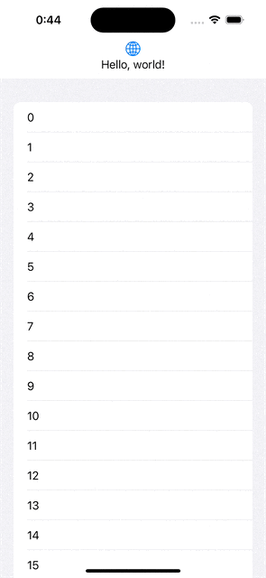

# Tardiness
    
An easy-to-use toast displayer & handler made specifically for SwiftUI

## Why Tardiness

You may want to notify the user with a simple message. This notification does not require any action from the user, so you don't want to block the user's current operation. What do you do in this case?

Maybe you'll choose to use an `Alert`. However, `Alert`s have a fatal flaw: they block the user's operation.

Then you might choose to use `UNNotification`. This is indeed an iOS-like notification method, but it is very cumbersome to implement in order to display it within the app, and above all, the notification banner itself is too large and can easily interfere with the user's operation.

Actually, Android has a very useful standard component: `Toast`. This is used to display a message on the screen for a short time without blocking the user's operation.

Unfortunately, iOS does not have such a standard component. That's where this library comes in. Tardiness is a library for easily displaying Toast in SwiftUI.

### Demo Example

```swift
List {
    // ...
}
.refreshable {
    displayToast?("Refreshed!")
}
```

### Execution Result



## Installation

### Swift Package Manager

#### Using Package.swift

1. Add package declaration in your package initializer

    ```swift
        dependencies: [
            .package(url: "https://github.com/el-hoshino/Tardiness", from: Version("0.1.0")),
        ]
    ```

2. Add package declaration in your targets you wish to use

    ```swift
            dependencies: [
                .product(name: "Tardiness", package: "Tardiness"),
            ]
    ```

#### Using SwiftPM managed by Xcode Project

1. Navigate to your Project settings
2. Select Package Dependencies tab
3. Add this repository's url in searchbar on top right

## Usage

Tips: You can also check for some examples in the Examples folder.

### Basic Usage

1. Import the package in your file

    ```swift
    import Tardiness
    ```

2. Make `ToastHandler` instance as `@State` in the root view you wish to handle the toasts

    ```swift
    struct ContentView: View {
        @State private var toastHandler = ToastHandler() // ← Add this line
    }
    ```

3. Apply `.displayToast` modifier in the same view

    ```swift
    struct ContentView: View {
        @State private var toastHandler = ToastHandler()

        var body: some View {
            // Your view content
                .displayToast(handledBy: toastHandler) // ← Add this line
        }
    }
    ```

4. Get `displayToast` property via `@Environment(\.displayToast)` in the child views you wish to show a toast 

    ```swift
    struct ChildView: View {
        @Environment(\.displayToast) var displayToast // ← Add this line
    }
    ```

5. Call `displayToast` property if needed

    ```swift
    struct ChildView: View {
        @Environment(\.displayToast) var displayToast

        var body: some View {
            Button("Show Toast") {
                displayToast?("Hello, World!")
            }
        }
    }
    ```

### Custom Toast View

The instruction above shows how to use the default toast view. If you wish to use a custom toast view, you can do so by providing a custom view in the `displayToast` modifier.

1. Create a custom view that conforms `View` with a `ToastHandler` property

    ```swift
    struct CustomToastView: View {
        var toastHandler: ToastHandler
    }
    ```

2. You can get information you need from the `toastHandler` instance

    - `currentToastMessage: String?`: Current toast message you need to display. `nil` if none.
    - `queueMessage(_ message: String)`: A function to queue a new message to be displayed as a toast.
        - `message`: Message to be queued.
    - `skipCurrent(in duration: Duration)`: A function to skip the current toast and display the next one in the queue.
        - `duration`: Duration for dismiss the current toast and display the next one.

3. Apply `.displayToast` modifier with your custom toast view

    ```swift
    struct ContentView: View {
        @State private var toastHandler = ToastHandler()

        var body: some View {
            // Your view content
                .displayToast(
                    on: .top, // ← Alignment to show the toast
                    handledBy: toastHandler,
                    toastMaker: { CustomToastView(toastHandler: $0) }
                ) // ← Add this block
        }
    }
    ```

## Why is this called Tardiness?

Ever seen an anime character running late to school with a toast in their mouth?

No? Please search `Toast of Tardiness` :P
